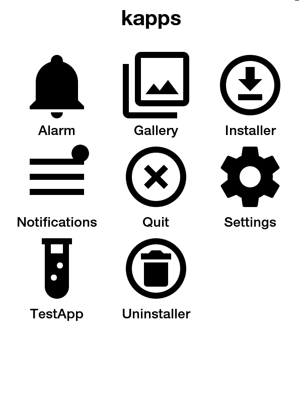
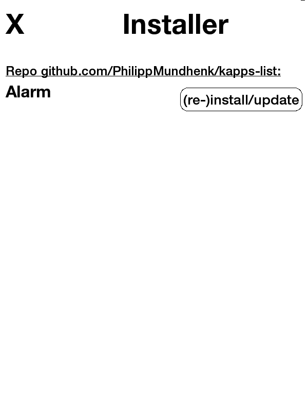
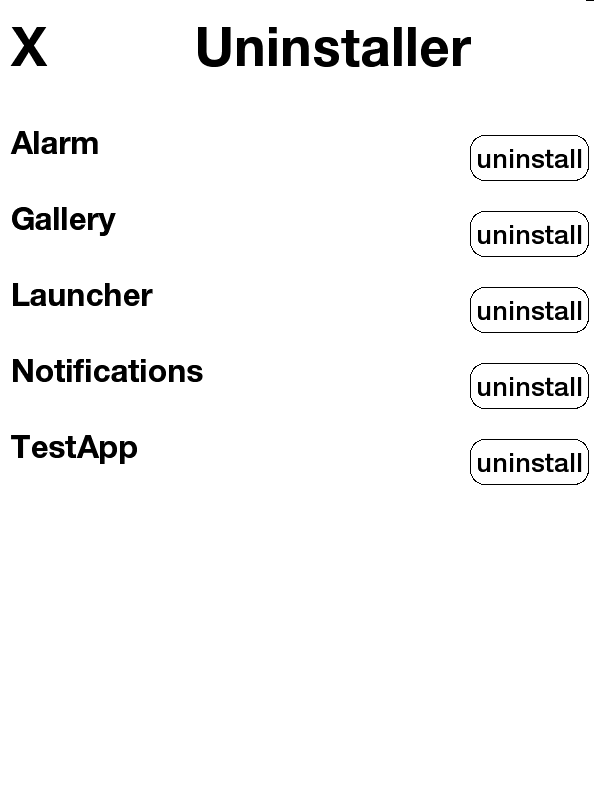
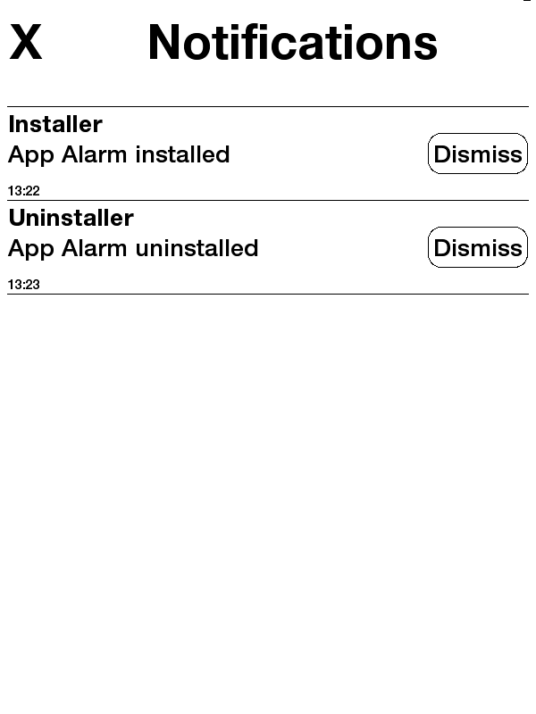
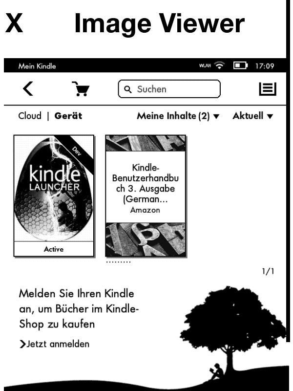

Note: There is a [Wiki](https://github.com/PhilippMundhenk/kapps/wiki) available with more extensive information than this page.

# kapps
kapps is a rudimentary app framework for Kindles with E Ink displays, such as the Kindle Touch, among many others. These devices run Linux and, with a jailbreak, can be made to run any software. This framework is based on a combination of Python and web technologies, allowing the implementation of applications, or apps, with or without graphical user interface (GUI). By providing a framework for communication between apps and the GUI, as well as defining a basic package format, apps can be easily loaded, and communicate with each other, as well as the GUI.

Note that this project is still in a very early stage, I might gradually extend it based on my needs and possible requests. I welcome any contributions.

## Motivation

Some time ago, I built and [Alarm Clock for a Kindle Touch](https://github.com/PhilippMundhenk/Kindle-Alarm-Clock). This was based on a HTML GUI, and a Python backend. It was kind of hacked together, but did the job of re-purposing an old Kindle Touch and using its very energy-efficient setup with E Ink display for a custom user interface. While one can generally built upon that to create own applications, the overhead to start a project is relatively high, multiple applications on a single device are potentially incompatible, and launching them might be difficult. I thus for a long time had the plan to extend the setup used for the alarm clock into a framework, which developers can use to create their own applications more easily. Since I have been working on different automotive software platforms, it seemed easy enough to do this in a context with less requirements on reliability and dependability.

The framework is rather rough around the edges for now and gives lots of freedom to the developer, both in terms of backend implementation, as well as frontend. Of course it might be helpful to follow some guidelines, which I shall write in future, but I want to leave it as open as possible, to allow the developer to adjust to his application.

The options for what can be implemented are endless. Here are some ideas:
- Alarm Clock (I shall port the existing one to kapps in future)
- Home Automation control / status display (e.g., calendar, commute times, (light) switches, ...)
- TV remote control with only the required favorite buttons
- shortcuts for PC control (like an Elgato Stream Deck)
- Audio (Music, radio, ...) player (Kindle Touch has audio out port)
- No frills recipe book for kitchen
- Learning apps (e.g., vocabulary trainer, math trainer, ...)
- ...

## Features

- Setup for GUI to backend connection, no need to handle webserver, URLs, etc.
- Application definitions, including (un-)installing from web
- Commands for communication between applications and GUI
- Notification system

## Concepts

The complete system is based on three components: Frontend, backend and commands.

The frontend is typically HTML pages shown in a web browser. The backend is a Python app, loaded by and integrated with the framework. Such backend app is typically called by a command, which may be coming from the frontend, and may return an HTTPResponse to be shown in the frontend. Commands are generally used to communicate between backend apps, as well as the GUI and apps.

As you can see, commands are essential for connecting the components. Some commands are built-in (e.g., Notify, Quit, Launcher), but every app can bring their own commands. One might compare them with Intents in Android. Commands can also be translated to URLs. This allows embeddeding them into the returned HTML shown on the frontend. The integrated webserver will catch such command calls and call the subscribed Python method with the given parameters.

Some more technical notes:
- Commands are always synchronous
- The complete system is operating in one thread. The developer is free to create their own threads.
- There are no security features built in, no separation between apps exist. Every app has full access to the system, other apps, as well as your Kindle!
- The system is built as flexible as possible. Almost everything is implemented as apps, this includes even the launcher, notifications, installer, etc. Additionally, as common in Python, no type safety is enforced (e.g., for commands)
- Publishers and subscribers of commands have an n:m relation: Multiple publishers might issue commands, multiple subscribers may receive them. Each for the receivers may return data. Thus, a call to publish() may return a list of answers.
- For the frontend, no frame is enforced. Thus, the developer of an app needs to ensure that the user can return to the kapps screen or go to other apps, e.g., by providing an exit button. This has been chosen to give absolute flexibility to the frontend developer.

## Installation

You first need to fulfill a number of requirements:

### Requirements

- Kindle Touch: Likely also running on other Kindles (or maybe other devices, with adaptations), but not tested.
- Jailbreak for Kindle Touch, see [here](https://www.mobileread.com/forums/showthread.php?t=275877)
- (optional) USB Networking, see [here](https://www.mobileread.com/forums/showthread.php?t=186645)
- WebLaunch, see [here](https://github.com/PaulFreund/WebLaunch)
- Python, see [here](https://www.mobileread.com/forums/showthread.php?t=225030)

Technically, WebLaunch is not required, as it uses the internal browser, but it is a nice wrapper, that I have not yet fully integrated. It is also an extension for KUAL, the Kindle Unified Application Launcher, which we will not be using.

### kapps

After all requirements are fulfilled, simply copy the folders etc/ and mnt/ from this repo to your Kindle's file system root (/).

## Application Examples

To show how easy a simple application can be, here are two examples, with and without GUI.

### Basic Application

The Quit application is a very basic application without GUI. It consists of only a few files:

```
Quit/
├─ res/
│  ├─ icon.png
├─ __init__.py
├─ quit.py
```

While the __init__.py only marks the existence of a module and is empty, the implementation contained in the quit.py is as simple as this:

```py
from core.kapp import Kapp
from core.commands import Quit, Launcher
from core.httpResponse import HTTPResponse


class QuitApp(Kapp):
    name = "Quit"

    def homeCallback(self, kcommand):
        self.publish(Quit())
        return self.publish(Launcher())[0]

    def iconCallback(self, kcommand):
    	return HTTPResponse(content=self.getRes("icon.png"))


def register(appID, appPath, ctx):
    return QuitApp(appID, appPath, ctx)
```

By default, every app implements at least the register() method. This creates a Kapp object, implementing the functionality. By default, a Kapp object subscribes to the Home and Icon commands, linking them to the homeCallback() and iconCallback() respectively. 
When listing the app in the launcher (potentially other places), the Icon command is issued for that app and consequently, the iconCallback() is called to retrieve the icon. This does not need to be static (see e.g., Notifications app). 
When starting the app, the Home command is issued and consequently the homeCallback() is called, potentially returning an HTTPResponse (see below), or itself calling another command, e.g., to start the launcher.

### Basic GUI Application

A simple GUI application can be as simple as this:

```py
from core.kapp import Kapp
from core.commands import Notify
from core.httpResponse import HTTPResponse


class TestApp(Kapp):
    name = "TestApp"

    def homeCallback(self, kcommand):
    	self.publish(Notify().setParam("title", "Test").setParam(
            "message", "TestApp started"))
        return HTTPResponse(content="<html><h1>TestApp Home Screen</h1></html>")

    def iconCallback(self, kcommand):
        return HTTPResponse(content=self.getRes("icon.png"))


def register(appID, appPath, ctx):
    return TestApp(appID, appPath, ctx)
```

The skeleton of this app is identical to the non-GUI app. However, we see that the homeCallback() here returns an HTTPResponse, resulting in a website being shown. Note that the given HTTPResponse is not optimal, as it traps the user on the page with no way to return to kapps.
Also note, how the Notify command is being used here to send a notification to the system, when the app is started.

## Screenshots

These screenshots are taken directly from the Kindle in kapps using the Screenshot command.

### Launcher



### Installer



### Uninstaller



### Notifications



### Gallery




## Improvements

I only built what I needed so far, the feature set might change in future, upon needs and requests. Here are some things on the very top of the list, but in no particular order:

- A proper, extensible logging system
- Tests
- An improved documentation, including API and examples
- Minimizing dependencies: Use browser directly without WebLaunch
- Easier install procedure
- Wrap more lipc commands (see [MobileRead Wiki](https://wiki.mobileread.com/wiki/Lipc))
- Self-update of core and minimize applications in core
- Dependency management for applications
- Better update management for applications (e.g., by including and checking version numbers)
- Support for more repositories to install
- Storage application for non-volatile storage (e.g., key-value store)
- Settings file and application
- WebSockets or similar to make GUI more responsive
- Extend support to other Kindles or other devices
- Extend support for non-touch devices
- Terminal for interacting with the system (e.g., manually sending/inspecting commands, listing loaded applications, general debugging, etc.)
- Support for automatically starting an app on boot
- Support for landscape apps